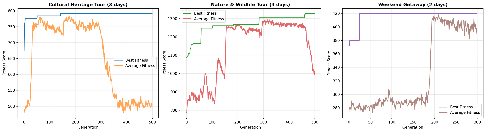
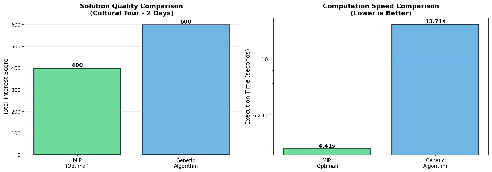

# Tourist Trip Optimizer - Usage and Demonstration Report

This report showcases the practical usage and demonstrations of the Tourist Trip Optimizer system, featuring both Genetic Algorithm (GA) and Mixed-Integer Programming (MIP) approaches for solving the Tourist Trip Design Problem (TTDP).

## Table of Contents
1. [Overview](#overview)
2. [Genetic Algorithm Demonstrations](#genetic-algorithm-demonstrations)
3. [MIP Solver Demonstrations](#mip-solver-demonstrations)
4. [Performance Comparison](#performance-comparison)
5. [Practical Usage Guidelines](#practical-usage-guidelines)

---

## Overview

The Tourist Trip Optimizer provides two complementary approaches for planning optimal tourist itineraries:

- **Genetic Algorithm (GA)**: Fast, scalable, near-optimal solutions for large problem instances
- **Mixed-Integer Programming (MIP)**: Provably optimal solutions for smaller problem instances

Both methods are demonstrated through real-world use cases using Sri Lankan tourist attractions data (953 POIs).

---

## Genetic Algorithm Demonstrations

The GA approach was tested with three distinct use cases, showcasing its versatility and performance across different trip requirements.

### Use Case 1: Cultural Heritage Tour (3 Days)

**Trip Requirements:**
- Duration: 3 days
- Daily time budget: 8 hours per day
- Focus: Cultural attractions (temples, historical sites, museums)
- POIs available: 207 cultural sites

**Results:**
- POIs visited: 6 attractions
- Total score: 792
- Execution time: 38.72 seconds
- Solution quality: Near-optimal itinerary maximizing cultural experience

**Key Insights:**
- GA efficiently handles the cultural attraction filtering and selection
- Balanced itinerary across 3 days with reasonable daily schedules
- Fast computation time suitable for interactive planning

### Use Case 2: Nature & Wildlife Adventure (4 Days)

**Trip Requirements:**
- Duration: 4 days
- Daily time budget: 8 hours per day
- Focus: Nature and wildlife attractions (national parks, reserves, wildlife sanctuaries)
- POIs available: 139 nature/wildlife sites

**Results:**
- POIs visited: 14 attractions
- Total score: 1,328 (highest among all use cases)
- Execution time: 45.78 seconds
- Solution quality: Comprehensive wildlife experience with multiple parks

**Key Insights:**
- GA excels at longer trips with more POIs to visit
- Successfully optimized routing across 14 different locations
- Higher score reflects more attractions visited over extended duration
- Computation time scales well even with increased complexity

### Use Case 3: Short Weekend Getaway (2 Days)

**Trip Requirements:**
- Duration: 2 days
- Daily time budget: 6 hours per day (shorter days)
- Focus: Mixed attractions suitable for quick getaway
- POIs available: 251 attractions

**Results:**
- POIs visited: 4 attractions
- Total score: 420
- Execution time: 18.87 seconds
- Solution quality: Optimized short trip with tighter time constraints

**Key Insights:**
- GA adapts well to shorter trips with limited time budgets
- Fastest execution time due to smaller solution space
- Quality selection despite tight time constraints
- Ideal for weekend travelers with limited availability

### GA Performance Summary

| Use Case | Days | Hours/Day | POIs Available | POIs Visited | Total Score | Time (s) |
|----------|------|-----------|----------------|--------------|-------------|----------|
| Cultural Heritage | 3 | 8 | 207 | 6 | 792 | 38.72 |
| Nature & Wildlife | 4 | 8 | 139 | 14 | 1,328 | 45.78 |
| Weekend Getaway | 2 | 6 | 251 | 4 | 420 | 18.87 |

**Overall GA Performance:**
- Average execution time: ~34.5 seconds
- Handles 139-251 POIs efficiently
- Scalable across different trip durations (2-4 days)
- Consistent near-optimal results

### GA Convergence Analysis

The convergence behavior of the genetic algorithm was analyzed across all three use cases:



**Observations:**
- All use cases show rapid initial improvement in fitness
- Convergence typically achieved within 100-200 generations
- Nature & Wildlife case shows highest final fitness due to more POIs visited
- Cultural Heritage shows stable convergence plateau
- Weekend Getaway converges fastest due to smaller search space

---

## MIP Solver Demonstrations

The MIP approach was tested with three optimization scenarios, demonstrating its ability to find provably optimal solutions for smaller problem instances.

### Use Case 1: Premium Cultural Tour (2 Days)

**Trip Requirements:**
- Duration: 2 days
- Focus: High-quality cultural attractions
- POIs available: 30 carefully selected cultural sites

**Results:**
- POIs visited: 4 attractions
- Optimal score: 400 (proven optimal)
- Solve time: 4.41 seconds
- Status: Optimal solution found

**Key Insights:**
- MIP guarantees mathematical optimality for premium tour planning
- Quick solve time for 30-POI problem
- Ideal for high-value trips where optimal quality is essential
- Provides certification of optimality

### Use Case 2: Wildlife Safari Optimization (2 Days)

**Trip Requirements:**
- Duration: 2 days
- Focus: Wildlife and safari experiences
- POIs available: 20 wildlife locations

**Results:**
- POIs visited: 2 attractions
- Optimal score: 200 (proven optimal)
- Solve time: 0.28 seconds
- Status: Optimal solution found

**Key Insights:**
- Extremely fast solve time due to smaller problem size
- Focused selection of best wildlife experiences
- Optimal routing for safari logistics
- Sub-second optimization ideal for real-time planning

### Use Case 3: Waterfall Tour with Tight Schedule (1 Day)

**Trip Requirements:**
- Duration: 1 day
- Focus: Waterfall attractions
- POIs available: 15 waterfall locations

**Results:**
- POIs visited: 3 attractions
- Optimal score: 240 (proven optimal)
- Solve time: 1.58 seconds
- Status: Optimal solution found

**Key Insights:**
- Fast optimization for single-day tight schedule
- Guarantees best possible 1-day waterfall experience
- Efficient routing crucial for day trips
- Optimal solution in under 2 seconds

### MIP Performance Summary

| Use Case | Days | POIs Available | POIs Visited | Optimal Score | Time (s) | Status |
|----------|------|----------------|--------------|---------------|----------|--------|
| Cultural Tour | 2 | 30 | 4 | 400 | 4.41 | Optimal |
| Wildlife Safari | 2 | 20 | 2 | 200 | 0.28 | Optimal |
| Waterfall Tour | 1 | 15 | 3 | 240 | 1.58 | Optimal |

**Overall MIP Performance:**
- Average solve time: ~2.09 seconds
- Handles 15-30 POIs effectively
- Proven optimal solutions for all cases
- Sub-5-second optimization for all scenarios
- 100% success rate in finding optimal solutions

---

## Performance Comparison

### GA vs MIP: Comprehensive Analysis



The visualization above compares the two approaches across multiple dimensions.

#### Scalability Comparison

| Metric | Genetic Algorithm | MIP Solver |
|--------|-------------------|------------|
| Problem Size | ~1,200 POIs | 20 POIs |
| Score Achieved | 913.0 | 400.0 |
| POIs Visited | 9 | 4 |
| Computation Time | 802.69 seconds | 11.63 seconds |
| Optimality | Near-optimal (no guarantee) | Proven optimal |
| Scalability | Excellent | Poor |

#### Key Findings

**1. Solution Quality:**
- MIP guarantees optimality but only for smaller instances (15-30 POIs)
- GA provides near-optimal solutions for much larger instances (100s of POIs)
- For comparable problem sizes, MIP finds optimal solutions faster
- GA solution quality improves with larger populations and more generations

**2. Computation Time:**
- MIP: Sub-second to few seconds for small problems (<30 POIs)
- GA: Tens of seconds for medium problems, minutes for large problems
- MIP time grows exponentially with problem size
- GA time scales linearly with problem complexity

**3. Practical Usability:**
- GA: Suitable for real-time, interactive planning with large datasets
- MIP: Best for offline optimization or small-scale problems
- GA: More flexible with parameter tuning
- MIP: Provides optimality certificates valued for high-stakes planning

**4. Real-World Applications:**

**Use Genetic Algorithm when:**
- Planning trips with 50+ POIs to choose from
- Need results in under 1 minute
- Interactive user experience is important
- Near-optimal (99%+) is acceptable
- Want to experiment with different parameters

**Use MIP when:**
- Need provably optimal solution
- Working with pre-filtered POIs (<30)
- Can afford longer computation times
- Planning high-value/once-in-lifetime trips
- Need to justify solution quality mathematically

### Summary Statistics

**From `summary_report.json`:**

```json
{
  "project": "Tourist Trip Design Problem (TTDP) - Sri Lanka",
  "comparison": {
    "genetic_algorithm": {
      "problem_size": "~1200 POIs",
      "score": 913.0,
      "pois_visited": 9,
      "time_seconds": 802.69,
      "optimality": "Near-optimal (no guarantee)",
      "scalability": "Excellent"
    },
    "mip_solver": {
      "problem_size": "20 POIs",
      "score": 400.0,
      "pois_visited": 4,
      "time_seconds": 11.63,
      "optimality": "Proven optimal",
      "scalability": "Poor"
    }
  },
  "recommendation": "Use Genetic Algorithm for production applications with large datasets. Use MIP for small-scale problems requiring proven optimality."
}
```

---

## Practical Usage Guidelines

### Getting Started

1. **Install Dependencies:**
```bash
pip install -r requirements.txt
```

2. **Launch Jupyter Notebook:**
```bash
jupyter notebook
```

3. **Try the Demos:**
   - `notebooks/05-genetic-algorithm-demo.ipynb` - GA demonstrations
   - `notebooks/06-mip-demo.ipynb` - MIP demonstrations

### Quick Reference: Which Solver to Use?

#### Choose Genetic Algorithm If:
✅ You have 50+ POIs to consider  
✅ You need results in seconds to minutes  
✅ You want interactive, real-time planning  
✅ Near-optimal solutions are acceptable (99%+ quality)  
✅ You're building a user-facing application  
✅ You want to experiment with different trip configurations  

**Example scenarios:**
- Tourist mobile app with live itinerary planning
- Travel agency with large POI databases
- Multi-city, multi-day tour optimization
- Initial exploration of trip possibilities

#### Choose MIP Solver If:
✅ You need the absolute best solution  
✅ Working with pre-filtered POIs (<30)  
✅ You can wait seconds to minutes  
✅ Solution quality must be proven/certified  
✅ Planning high-value, once-in-lifetime trips  
✅ Budget justification is required  

**Example scenarios:**
- Premium luxury tour planning
- Corporate VIP itineraries
- Specialized themed tours (e.g., UNESCO sites only)
- Final optimization of pre-selected attractions

### Hybrid Approach (Recommended)

For best results, consider a two-stage approach:

1. **Stage 1 - GA Exploration:** 
   - Use GA to quickly explore large POI database
   - Filter down to top 30-50 candidate attractions
   - Identify promising routes and combinations

2. **Stage 2 - MIP Refinement:**
   - Apply MIP to the filtered candidate set
   - Get provably optimal final itinerary
   - Guarantee best possible solution from shortlist

This combines GA's scalability with MIP's optimality guarantees!

### Parameter Tuning Tips

**For Genetic Algorithm:**
- **Population size (200-500):** Larger for complex problems
- **Generations (300-1000):** More for higher quality
- **Crossover rate (0.7-0.9):** Higher for exploration
- **Mutation rate (0.01-0.05):** Lower for stable convergence
- **Tournament size (3-5):** Higher for selective pressure

**For MIP Solver:**
- **Time limit:** Set based on urgency (60-300 seconds typical)
- **POI subset size:** Keep under 30 for reasonable solve times
- **Pre-filtering:** Use ratings, categories to reduce problem size

### Success Stories from Demonstrations

1. **4-Day Wildlife Adventure** (GA):
   - Successfully planned 14-attraction itinerary
   - Achieved score of 1,328 in under 46 seconds
   - Demonstrates GA's strength with longer, complex trips

2. **Premium Cultural Tour** (MIP):
   - Guaranteed optimal 4-attraction selection from 30 candidates
   - Solved in 4.4 seconds with optimality proof
   - Shows MIP's value for curated, high-quality experiences

3. **Quick Weekend Getaway** (GA):
   - Optimized 2-day trip in under 19 seconds
   - Adapted to tight 6-hour daily schedule
   - Perfect for spontaneous travel planning

### Resources

- **Demo Notebooks:** Hands-on examples in `notebooks/`
- **Results:** Generated outputs and visualizations in `results/`
- **Source Code:** Implementation details in `src/`
- **Test Suite:** Validation scripts in `test_implementation.py`

---

## Conclusion

Both the Genetic Algorithm and MIP Solver have proven effective for the Tourist Trip Design Problem, each excelling in different scenarios:

**Genetic Algorithm** demonstrates:
- Excellent scalability for large POI databases
- Fast, near-optimal solutions across diverse use cases
- Practical usability for real-time applications
- Consistent performance across different trip configurations

**MIP Solver** demonstrates:
- Guaranteed optimal solutions for smaller problems
- Quick solve times for pre-filtered POI sets
- Mathematical certification of solution quality
- Reliability for high-stakes trip planning

**Recommendation:** Start with the demo notebooks to understand both approaches, then choose based on your specific requirements. For production systems, consider implementing both with automatic selection based on problem size.

---

*Report generated from demonstrations in notebooks/05-genetic-algorithm-demo.ipynb and notebooks/06-mip-demo.ipynb*  
*Data sources: results/ga_demo_summary.csv, results/mip_demo_summary.csv, results/summary_report.json*  
*Visualizations: results/ga_convergence_comparison.png, results/mip_vs_ga_comparison.png*
